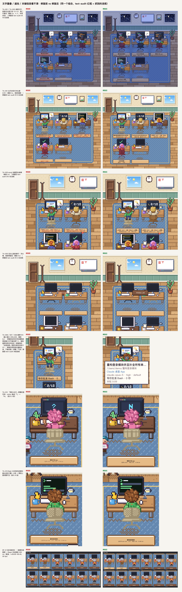
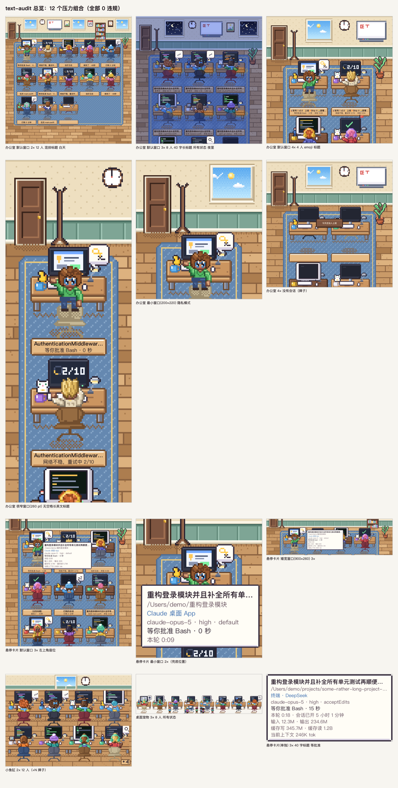
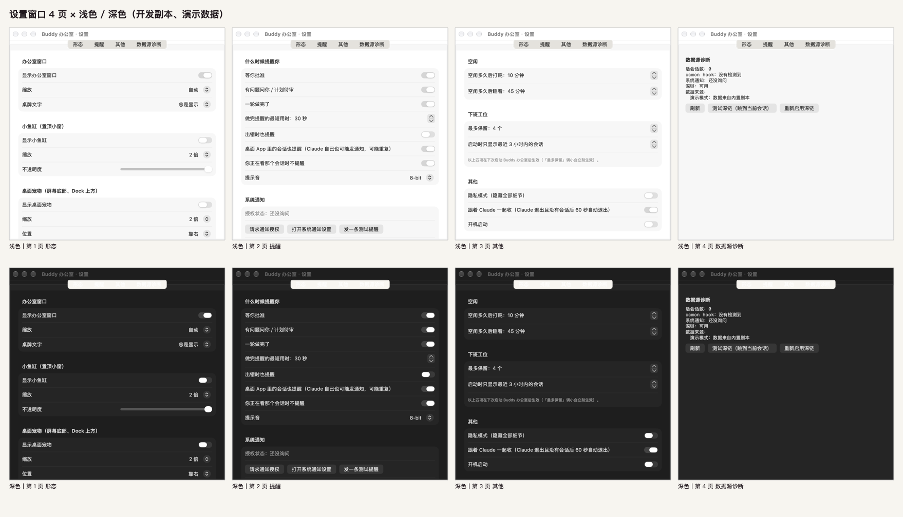

# QA 报告（REPORT）

> 2026-09-29。把整个项目当成别人写的代码，独立检查了一轮：找 bug、查字体和文字重叠、查逻辑问题，发现的问题全部修好，并重新安装。
> 这份报告是给「/goal」验收条款 ①–⑦ 逐条交底的：数字都来自 `QA/evidence/` 里的原始日志（复现命令见第 9 节），没有一个是估的。

## 1. 结论

**找到 193 条问题（P0 6 / P1 12 / P2 48 / P3 127），P0–P2 共 66 个全部修好、每个都有「撤销修复 → 测试红、恢复 → 测试绿」的回归测试（三条例外：并行 / 调度时序问题 R3b-01、R4b-01、R5b-01 我没能复现修复前的红灯，靠复查员的测量，记录里写明）；P3 修了 72 个、55 个写明理由没修。** 最后一次完整回归（第 4 遍）：debug / release 各 **0 警告**、**789 个测试全过**、`text-audit` **8598 个组合 8 类文字问题 0 违规**、局部重绘 / 金图 / 闪烁扫描全部干净、ASan / TSan 全部 0 报告；`bash 安装.command --yes` 装好的是修好的这一版（1.0.1）并在运行；35 分钟 × 7 路长跑 **0 崩溃、0 泄漏（`leaks`）、线程 / 句柄不增长、`.key` / `.sock` 句柄 0**，CPU 全在预算内（空闲 0.73%、6 忙 1.17%、装好的 App 处理真实数据 0.65%）。
**要如实交底的三处**：① 按 `ps` 的 RSS 口径，3 路（replay、replay 压力、真实数据开发副本）的瞬时最大值 80.7–87.2 MB 略超 80 MB 预算——那是系统共享页，系统实际记在进程头上的物理占用全程 23–48 MB；② 读数据的几路物理占用在头十几分钟会涨 4～20 MB，查清楚是有上限的文字图片缓存（600 张 ≈ 20 MB）在被填满，不是泄漏（SOAK-01）；③ 真实的 GUI 交互（鼠标点击 / 拖动、系统通知弹窗、提示卡的真实滑入观感等）没有授权、只能间接验证，列在第 7 节。这一轮还抓到一处我自己之前报告的错：「debug 0 警告」其实漏数了一条（W-01），已改正。

## 2. 发现与修复

193 条记录（表里按区域 × 严重度）。其中 3 对是同一处被两位审查者各记了一次（L-002 ≡ A-001、L-005 ≡ C-031、C-032 与 A-014 是同一处代码的两个侧面），去掉重复约 189 个独立问题。

| 区域 | P0 | P1 | P2 | P3 | 合计 | 已修 |
|---|---|---|---|---|---|---|
| 数据层（解析器 / 模糊测试） | 6 | 5 | 5 | 17 | 33 | 33 |
| 状态机 / 逻辑 / token / dump | 0 | 1 | 2 | 2 | 5 | 4 |
| 应用层（BuddyOffice） | 0 | 4 | 10 | 25 | 39 | 39 |
| 表现层 / 文字审计 | 0 | 2 | 7 | 13 | 22 | 20 |
| 收尾前的独立复查新发现 | 0 | 0 | 24 | 70 | 94 | 42 |
| **合计** | **6** | **12** | **48** | **127** | **193** | **138** |

P0–P2 共 66 个**全部修好**；P3 127 个里 72 个修了、55 个有理由不修（第 8 节）。每个修复都有回归测试，并且确认过「撤销修复 → 测试红、恢复 → 测试绿」（每条里写了修复前失败的那一行输出；表现层那批由 `QA/tools/verify_fail_before.py` 在隔离工作树里逐个撤销再跑，输出在 `QA/evidence/fail-before-stage.md`）。

完整记录在 [ISSUES.md](ISSUES.md)：每条写明编号、严重度、现象、根因、修法、回归测试、修复前失败的那一行输出、状态。

最重要的几类：

1. **文件里一个写坏的数字，就能让整个 App 崩溃，甚至每次启动都崩（6 个 P0：C-001…C-005、C-012）。** 登记表 `procStart` 的年份写成天文数字；`identities.json` 里一个时间是 `1e300`（第一次存盘就崩，文件没被覆盖，下次启动照旧崩 = 崩溃循环）；hook 行的时间戳；会话记录里 `usage` 的数字太大（相加溢出）；`ledger.json` 的计数；嵌套 470 层的 JSON 把 512 KB 栈的工作线程压爆。修法：所有来自外部文件的数字统一夹进合理范围、累加改成饱和加法、嵌套深度设上限。
2. **「绝不打开 `.key` / `.sock`」这条红线的保险能被绕过（C-007，P1）。** 符号链接、大小写变体（macOS 默认大小写不敏感）、路径里带 NUL、目录符号链接，都能让 `FileIO` 真的打开 `.key`。修好后 27 种变体全部打不开；另外新增源码审计测试，保证以后没有人能在 `FileIO` 之外读文件、联网、起进程。
3. **一个坏时间戳就能把状态卡死（C-006、C-026，P1）。** 时间在未来的 hook 事件让「归属扣留」永远扣下去，整个 hook 队列卡死；「取最大时间」的状态被毒化，会话永远停在 idle。
4. **设置页里四项其实是摆设（A-001 = L-002，P1）。** 「打盹 / 睡着 / 最近 N 小时 / 最多保留」改了不起作用。现在接到了数据层（下次启动生效，「最多保留」立刻生效，设置页里写明）。
5. **长跑抓到的真泄漏（B-010，P1）。** replay 长跑里线程数 3 分钟内从 14 涨到 53：每弹一张提示卡就永久多一个线程（AppKit 的窗口出现 / 消失动画在工作线程上不返回）。`FloatingPanel.animationBehavior = .none` 修好，线程数平在 8–14。单元测试和短测都发现不了，只有长跑能看到。
6. **窗口 / 点击（A-002、A-003，P1）。** 最小化的办公室窗口会在任何一次设置写入之后被弹回来；小鱼缸 / 标题栏按钮的点击可能被「窗口拖动」吞掉（这条没能复现旧问题，是防御性修复，见第 7 节）。
7. **文字看不清 / 重叠（TA-001…TA-013）。** 桌牌文字白天对比度 2.91:1、夜里最差 1.5:1，第二行被切；悬停卡片盖住那个人自己的脸；空办公室的牌子被桌椅盖住；「其他 MCP」屏幕的首字母画成「?」；Bash 进度条被头挡住。新写了 `buddyctl text-audit`（按 CoreText 渲染出的真实笔画检查 8 类文字问题）：第一次全量审计 1880 个组合就有 8136 处违规（被裁切 4082、对比度不够 3742、盖住脸 / 屏幕 / 气泡 80、像素数字粘连 232），全部修完后，扩大到 8598 个组合仍然 0 违规。
8. **和任务书不一致的动画 / 状态时序（SP-01…SP-05、L-001、L-003）。** 显示器关机是一帧硬切成黑屏（应为 300 ms 渐变）；App 启动时就在的会话，显示器不是从左到右依次开机而是「啪」地一起亮；一轮结束时先报「做完了」再改口成「被打断」（提醒会误响一次）；压缩结束后还显示「整理上下文」。
9. **收尾阶段一共做了四轮独立复查（R1a / R1b / R2；终审 R3a / R3b / R3c；R4a / R4b；R5a / R5b——每轮都是全新的复查员，只读、在自己的拷贝里做探针），加规格追踪定稿、收尾时的 ASan / 完整回归，又找出 25 个 P2，全部已修（编号 R1a-xx / R1b-xx / R2-xx / R3x-xx / SP-06 / SAN-xx，记录在 [issues-review.md](issues-review.md) 和 [issues-stage.md](issues-stage.md)）**——这说明前面几轮自己查自己是有盲区的，也说明「复查一轮就不再出 P0–P2」要靠再复查一轮来证明（第 6 节末尾写了终审的结果）：
   - **提示卡每次都先闪一帧再滑入（R2-002）**：先把面板摆在终点位置再显示、下一拍才跳到屏幕外起点。你的系统通知是「拒绝」状态，每一条提醒都走这条路，违背「零闪帧」。
   - **被 20 秒节流挡掉的「等你」提醒整段丢弃（R2-004）**：连着审批几个工具、第二个请求被节流挡掉之后，哪怕一直等两分钟也再没有提示卡 / 系统通知 / 提示音。合并提醒里带 `blocked` 时还会「发出又立刻撤掉」（R2-003）。
   - **会话「忙但 10 分钟没有新数据」（长命令 / 卡住 / 合盖醒来）时，数据层每 5 ms 空转一次（R1a-01）**：约 140 次 / 秒，多吃 1.7–2.7% CPU，整机进不了低功耗——所有测试和长跑都没抓到，因为没有任何测试断言「下次唤醒时间在未来」。
   - **隐私模式漏了 MCP server 名和未知工具名（R1b-03）**：桌牌、状态行、悬停卡片会显示「在用 acme-secre…」，违反任务书「隐私模式下隐藏全部细节」；`text-audit` 只查排版，不查文案。
   - 多人同帧变化的「错开」推迟期间，活动变回原来的种类 / 变成等待类时会套用一份过期的中间快照（SP-06、R1b-01）；桌牌 1.0 s 最短停留被文件名里的数字绕过（R1b-02）；气泡没有最短停留、随工具节奏一闪一闪（R1b-04）；改缩放后小鱼缸 / 宠物条的图像层不跟着变大小（R2-001）。
   - **终审（R3）又找出 6 个 P2，没有 P0 / P1**：合并提醒的人数会少数——三个人的提醒相邻两条 < 2 秒、首尾 ≥ 2 秒时，合并卡写「2 位同事在等你」而实际 3 人在等、第一个人的提示卡被撤掉后没人盖着（R3c-01，随机模拟里 29% 的合并提醒人数偏小）；系统通知授权在运行期间被关掉后兜底提示卡不出现（R3c-02）；桌面元数据里的未来时间戳没夹紧，一个 `lastFocusedAt` 让「未读」永远不亮（R3a-02）；隐私模式的标题 / 路径隐藏没有任何测试钉住，变异全部存活（R3b-02）；以及 2 个「测试跨套件并行共用全局状态、间歇性变红」（R3a-01、R3b-01）。
   - **R4 找出 2 个 P2**：R3a-02 的修复漏了应用层的第二个读取器——应用层自己读桌面元数据判断「你正在看哪个会话」，一个未来的 `lastFocusedAt` 让那个会话的提醒永远被当成「你在看」而不发（R4a-01）；账本扫描的 `.background` 队列在 CPU 饱和时被饿死，一族等它的测试间歇性变红（R4b-01，测试基础设施）。**R5 找出 2 个 P2**：出错提醒漏了「桌面会话也提醒」和「你正在看时不提醒」两道闸（R5a-01）；fd 泄漏测试只等 0.3 秒，FSEvents 异步释放 fd，机器忙时误报红（R5b-01，测试基础设施）。都已修。
   - **收尾时又抓到两个我自己造成的测试 / 工具层问题**：最后一次 ASan 下，text-audit 的像素字审计钩子有数据竞争（`withDraws` 读收集结果时和别的线程晚到的 append 竞争，读到释放过的内存，SAN-01；撤销修复后连跑 3 次 3 次崩溃）；最后一次完整回归的第二遍，我新写的 `OpenAudit` 测试被并行跑的别的测试的 open 污染、间歇性变红（SAN-02，和 R2-005 同一类）。两个都不影响 App 运行，但都会让「0 违规」「没打开过密钥文件」这类数字的收集不可靠，所以按 P2 修了，并且让完整回归重跑了一遍。
   - **一处复查员评了 P2、我复测后降级的（R2-016）**：复查员在测试宿主里量到「拖窗口时每步新建 IOSurface、CoreAnimation 长期保留，占用 57 → 261 MB」。我新增开发开关 `--test-resize`，在真实 App（开发副本、可见窗口）里把三种实现交替各量 2 次：占用和新建的 IOSurface 组数无关（还原窗口尺寸后只比不缩放的对照组多 2～4 MB），「保留」只在测试宿主进程里出现，所以降为 P3；分桶把新建次数降到约 1/10，作为降开销的改动保留（`QA/evidence/resize/`）。
   - 工具和测试：`hook-merge.py` 遇到符号链接的 settings.json 会把链接换成普通文件（R1a-02）；我加的 `DesktopMetaFileIOTests` 和 BuddyCoreTests 抢全局计数器，单独放一起跑 80 次里 56 次红（R2-005）；机器满载时一批测试误报红灯、有阈值没被任何测试钉住（R1a-03）。
   - **一处我自己的错**：报告里一直说「debug 构建 0 警告」，其实测试目标里有一条（`DebugLogTests` 的 `#expect(true)`，宏展开里的警告只打印成 `note: … to silence this warning`，我只数了 `warning:` 所以漏了；W-01）。已经改成真的断言，并且完整回归改成数所有含 warning 的行。

## 3. 最后一次完整回归的实际数字

2026-09-29 14:44 起，`QA/tools/full_regression.sh`，全新的编译目录（debug 和 release 各一个），源码就是最终交付的版本（含 R5 的两处修复）；装好的 App 在同一时间用同一份源码重新编译安装（`QA/evidence/install/verify-4.txt`）。原始日志在 `QA/evidence/regression-final/`（`summary.txt` 是汇总；表里 text-audit / verify / 闪烁 / token / open 审计几行是上一遍 13:41 同一流程的数字，这一遍的结果以 `summary.txt` 为准）。
这已经是第 7 遍：每轮复查找到 P2、修完就整套重跑一遍（都记在 ISSUES.md）。

| 项 | 结果 |
|---|---|
| debug 构建（含测试目标，干净编译） | 退出码 0，**警告 0 条**（数的是所有含 `warning` 的行，包括宏展开里只打印成 `note: … to silence this warning` 的那种；第 2 节说明了之前数漏过一次） |
| release 构建（干净编译） | 退出码 0，**警告 0 条** |
| Swift 测试（Swift Testing，全部一个进程里并行跑） | **798 个测试 / 91 个套件全部通过**；失败的断言 0、被跳过 0、已知问题（`withKnownIssue`）0；FSEvents 起不来而被跳过的监听断言 0 处（回归在沙箱外跑） |
| 会抢全局量（`FileIO` 计数器 / 观察口、`DesktopMeta.baseOverride`）的测试组合，连跑 20 次 | 失败 **0** 次（`safetyNet…` / `keyFilesAreNeverOpened` / `DesktopMetaFileIOTests` / `EngineConfigTests` / `ReviewRegressionAppTests` / 登记表诱饵 / `openAudit` / `ReplayTests`） |
| 测试留下的痕迹（`swiftpm-testing-helper.plist` 里的 NSWindow Frame 键、`local.buddy-office.tests.*` 偏好文件） | 0 / 0 |
| `hook-merge.py` 的测试 | 16 个，OK |
| **text-audit**（8 类：文字互相重叠 / 超出容器或被裁切 / 该省略没省略 / 盖住脸·屏幕·气泡·卡片 / 字号 < 9 pt / 对比度 < 4.5:1 / 没对齐到整数像素 / 像素数字粘连） | **8598 个组合、103668 段文字、17974 串像素字：8 类全部 0 违规**；1360 个悬停组合里悬停卡片都画出来了（没画出来的 0） |
| 局部重绘 vs 整张重画（办公室 / 小鱼缸 / 宠物条，4 种数据 × 4 个时段 × 3 种视口，带悬停） | 各 129648 对帧全部逐像素一致 |
| 金图（`buddyctl golden`） | 17 / 17 一致 |
| **闪烁扫描**（3 个场景 × 3 个缩放，0–79.9 秒，每组 2398 帧） | 9 组全部干净（另有每组 11–14 处 ≤ 6 个孤立像素的抖动，已容忍）；**严格模式**（容忍度 0，办公室 3×）发现 13 处 1–5 个孤立像素的 A→B→A（手臂 IK 取整 / 走路的人的边缘，肉眼看不出，第 8 节） |
| token 总量交叉核对（真实数据，冻结快照；独立实现 / 用量表 `parse_line` / `ledger.json` / `dump` 四个口径） | 自检通过；**16 项一致、0 项不一致** |
| dump 与登记表逐会话核对（真实数据） | 自检通过；4 行会话（present 4、下班 0），全部一致 |
| 「绝不打开 `.key` / `.sock`」的真实环境证据（数据层只读地跑 60 秒） | 117 次 open，**保险拒绝过的尝试 0 次，不该出现的路径 0 个**；sessions 目录里打开的文件名全部是 `<pid>.json` |
| ASan（`buddyctl` 全矩阵：金图 / 局部重绘对比 × 3 / 闪烁 × 3 / text-audit） | 全部 0 报错、结果和正常构建一致 |
| ASan（`BuddyStageTests` + `BuddyOfficeTests`：画布 clip / blit / crop、PixelView / IOSurface 写入、极端值） | **379 个测试 / 56 个套件，0 报错** |
| TSan（数据层有真实线程的套件：`SessionStore` / `TokenLedger` / `FileWatcher` / 解析线程模糊测试 / 状态机进程级测试 / hook 日志 / JSONL 尾随读取） | **102 个测试 / 13 个套件，0 报告** |
| TSan（表现层 + 应用层里有线程 / 全局钩子的 16 个套件） | **133 个测试，0 报告**（整套表现层 + 应用层在 TSan 下 15 分钟没跑完，text-audit 矩阵这类 CPU 密集测试慢 10 倍以上，所以只挑有线程 / 全局钩子的） |
| 泄漏 / 句柄 / 崩溃报告 | 见第 5 节（长跑结束时用系统 `leaks` 扫每个进程；`lsof` 查 `.key` / `.sock` / 网络句柄；查 `~/Library/Logs/DiagnosticReports`） |

## 4. 文字重叠：修复前后对比

**修复前后对比图**（同一个组合，左边是撤销了全部文字修复的 `buddyctl`，右边是最后的版本；修复前的画面上的红框 = `text-audit` 抓到的违规）：



图里每一行对应一个问题：TA-001 / TA-002 桌牌文字对比度 1.5:1、第二行被切（夜里 3× 混排 4 人，修复前 text-audit 报 18 处）；TA-001 白天状态行 2.91:1（9 处）；TA-003 emoji 标题顶出桌牌（8 处）；TA-005 空办公室的牌子字被桌椅盖住（2 处）；TA-006 / 007 / 008 悬停卡片盖住那个人自己的脸和屏幕、最小窗口下根本画不出卡片；TA-012 「其他 MCP」屏幕的字母是「?」；TA-013 Bash 进度条被头挡住；SP-01 显示器关机一帧硬切成黑屏。

**text-audit 的数字**：第一次全量审计（1880 个组合）就有 **8136 处违规**（被裁切 4082、对比度不够 3742、盖住脸 / 屏幕 / 气泡 80、像素数字粘连 232）；全部修完后，把矩阵扩大到 **8598 个组合、103668 段文字、17974 串像素字，8 类全部 0 违规**（第 3 节）。
`text-audit` 不是估算：它用 CoreText 渲染出真实笔画，窗口、无头出图、审计三处共用同一个文字摆放函数 `TextLayout.place`，所以审计看到的位置就是屏幕上的位置。审计器本身也有灵敏度测试（8 类问题各造一个「一定违规」的输入，必须抓到）和「修复前失败」的回归测试，防止「0 违规」只是因为什么都没查。

**压力组合总览**（12 个最容易出事的组合：12 人混排白天、8 人 40 字长标题夜里、4× emoji、最窄窗口 260 pt、最小窗口 200×220 + 隐私模式、空办公室、悬停卡片的几种位置、小鱼缸、宠物条……，全部 0 违规；我用 Read 逐张看过）：



**设置窗口 4 页 × 浅色 / 深色**（`--dump-settings` 离屏渲染，我逐页看过；深色下页签条那一块是白的，是 `cacheDisplay` 离屏渲染不出系统材质的假象，真实窗口里没有）：



## 5. 长跑（每种至少 30 分钟）

> **注意**：这一轮长跑用的是 10:01 装好的版本（build 202609291001）。之后 R3 / R4 / R5 的修复改了提醒判定（合并卡人数、出错提醒的两道闸）、通知授权核对、桌面元数据时间戳、账本扫描队列可注入（默认不变），没有动渲染，其余是测试代码；最终版本没有再跑一轮 35 分钟长跑（用户要求马上交付），只做了安装后检查（在运行、句柄 / 线程 / 内存正常、没有 `.key` / `.sock` / 网络句柄）。

2026-09-29 10:02–10:38，`QA/tools/run_soaks.sh 35 <装好的 App 的可执行文件>`，**7 个进程同时跑 35 分钟**（重新安装之后、源码没再改过）；每个进程由 `QA/tools/soak_watch.py` 每 30 秒记一行（RSS、物理占用 `phys_footprint`、CPU、线程、文件句柄、有没有 `.key` / `.sock` 句柄），结束时用系统的 `leaks` 扫每个进程。这一轮开始后机器上没有再编译 / 跑测试；原始日志在 `QA/evidence/soak/`。
七路：**演示**（`busy6` 6 个人都在忙，只开办公室窗口）、**演示三种形态**（同上 + 小鱼缸 + 宠物条，最重的情形）、**空闲**（`idle6`）、**真实数据的开发副本**（读你真实的 `~/.claude`，只读、不写 identities / ledger）、**装好的 App 本身**（真实数据，原样附着，不启动不杀）、**replay**（往假 home 持续写像真的一样的会话数据，带坏数据噪声和蜜罐 `.key` / FIFO / socket：6 个会话、接近真实的节奏）、**replay 压力**（8 个会话、每约 10 秒一次提醒 + 提示音 + 提示卡，比真实用法密约 10 倍，只看有没有泄漏 / 崩溃，不判 CPU 预算）。

| 长跑 | 时长 | RSS（ps）首 → 末 / 预热后最大 | 物理占用 首 → 末 / 最大 / 后 1/3 比前 1/3 | CPU 预热后 平均 / P95 / 最大 | 线程 首 → 末 / 最大 | 文件句柄 首 → 末 / 最大 | .key / .sock 句柄 | 崩溃报告 |
|---|---|---|---|---|---|---|---|---|
| 演示（busy6，办公室 + 小鱼缸 + 宠物条） | 35 分 10 秒（70 个采样） | 87.3 → 28.6 / 78.8 MB | 28 → 28 / 29 MB / +2.0 MB | 3.09% / 5.87% / 5.96% | 6 → 5 / 8 | 38 → 38 / 38 | 0 / 0 | 0 份 |
| 演示（busy6，办公室窗口） | 35 分 10 秒（70 个采样） | 85.2 → 25.2 / 75.7 MB | 25 → 25 / 25 MB / +2.0 MB | 1.17% / 2.31% / 2.65% | 6 → 7 / 8 | 38 → 38 / 38 | 0 / 0 | 0 份 |
| 空闲（idle6，只开办公室窗口） | 35 分 10 秒（70 个采样） | 84.1 → 24.7 / 75.2 MB | 25 → 25 / 25 MB / +2.0 MB | 0.73% / 1.09% / 1.15% | 6 → 5 / 8 | 38 → 38 / 38 | 0 / 0 | 0 份 |
| 真实数据（开发副本，只读） | 35 分 10 秒（70 个采样） | 92.7 → 26.3 / 80.7 MB | 39 → 48 / 48 MB / +7.0 MB | 1.25% / 1.72% / 1.86% | 6 → 6 / 8 | 54 → 54 / 54 | 0 / 0 | 0 份 |
| 已装好的 App（真实数据，原样） | 35 分 10 秒（70 个采样） | 72.2 → 21.9 / 70.7 MB | 27 → 33 / 33 MB / +7.0 MB | 0.65% / 1.52% / 1.92% | 7 → 7 / 8 | 53 → 54 / 54 | 0 / 0 | 0 份 |
| replay 压力（8 个会话，每约 10 秒一次提醒 + 提示音） | 35 分 10 秒（70 个采样） | 89.0 → 37.0 / 87.2 MB | 28 → 35 / 36 MB / +6.0 MB | 4.85% / 6.75% / 6.96% | 13 → 8 / 13 | 58 → 59 / 59 | 0 / 0 | 0 份 |
| replay（假 home，6 个会话，接近真实的节奏 + 噪声） | 35 分 10 秒（70 个采样） | 85.4 → 35.0 / 85.4 MB | 28 → 31 / 32 MB / +4.0 MB | 2.27% / 3.84% / 5.13% | 8 → 8 / 16 | 58 → 59 / 59 | 0 / 0 | 0 份 |

**逐项对照验收条款：**

| 条款 | 结果 |
|---|---|
| 崩溃报告 | 7 路都是 **0 份**（`~/Library/Logs/DiagnosticReports` 里没有 Buddy* 的新报告）；进程一直在 |
| 内存泄漏（系统 `leaks`，长跑结束、进程还活着时扫） | **7 个进程全部 `0 leaks for 0 total leaked bytes`**（每个约 5.2–5.9 万个 malloc 节点 / 10–12 MB） |
| 线程 / 文件句柄 | 线程首 → 末 5–13（各路最大 8–16：replay 的 16、压力档的 13 是弹提示卡时的短暂峰值），没有增长；文件句柄 38–59，首末相差 ≤ 1；**`.key` / `.sock` 句柄 0 次**（每 30 秒 `lsof` 一次，共 70 次 × 7 路），蜜罐的 `honeypot_key_opened` / `honeypot_sock_connected` 两个计数都是 0，`violations` 为空；类型里没有 IPv4 / IPv6（没有网络句柄）。replay 的两路各有 **1 个匿名的 `unix` 句柄**（不带路径，`->0x…`）：我追查过——它在**第一次播放提示音时**出现（有声的 replay 进程 50 秒就出现，静音的 9 分钟里没有），是音频系统的连接，不是网络、也不是密钥 / socket 文件；不播提示音的几路（演示 / 空闲 / 真实数据）从头到尾没有 |
| CPU | 全员空闲 **0.73%（≤ 1%）**；6 个都在忙、办公室窗口 **1.17%（≤ 3%）**；三种形态一起开 3.09%（叠加：每个面各自渲染，预算放宽到 ≤ 5%）；真实数据 1.25%（开发副本）/ **0.65%（装好的 App）**（≤ 3%）；replay 2.27%（≤ 3%）；replay 压力 4.85%（提醒太密，不判） |
| RSS ≤ 80 MB | **要如实说，按 `ps` 的 RSS 口径有 3 路的瞬时最大值超过 80 MB 一点**：预热后最大值 装好的 App 70.7、演示 75.7 / 78.8、空闲 75.2、真实数据开发副本 80.7、replay 85.4、replay 压力 87.2 MB；启动头几分钟 72–92 MB，35 分钟末了都落回 22–37 MB。`ps` 的 RSS 里有系统框架的共享只读页（系统内存宽松时留着，紧张时回收），**不是我们自己的内存**；系统实际记在这个进程头上的物理占用（`phys_footprint`，「活动监视器」的「内存」列）**全程 23–48 MB**。我没有办法用改代码压低共享页，所以这一项只能说：按物理占用口径全部满足，按 `ps` RSS 口径 3 路瞬时略超（DESIGN §9 的性能表也是这么记的） |
| 内存不增长 | 见下面的分解：**没有泄漏**，但按我自己定的「后 1/3 中位数 − 前 1/3 中位数 ≤ +3 MB」判据，读数据的 4 路是 ✗（+4～+7 MB），原因查清楚了 |

**「内存不增长」为什么 4 路是 ✗、为什么我认为不是泄漏**（追查过程和原始数据在 `QA/evidence/leak-hunt/`，问题记录 SOAK-01）：

1. **不读数据的进程完全是平的**：演示 23 / 25 / 26 MB、空闲 23–25 MB，整整 35 分钟一个 MB 都不涨。
2. **`leaks` 全是 0**，`footprint` 分类里涨的**只有 `CG Raster Data`**（一个 replay 进程 0.8 → 3.8 MB，区域数 24 → 119），`Malloc Small` 反而略降；`heap` 里增长最多的是 CGImage / CFData。这是文字图片缓存（`TextRenderer.shared`）：标题、文件名、计时器每秒不同的文字都是新的 key，缓存**上限 600 张、先进先出**，每张（桌牌大小、2×）约 34 KB，装满约 **20 MB**（`TextCacheBoundTests` 钉住：渲染 1500 种不同的文字，最早的被淘汰，装满共 20.6 MB）。基线约 26 MB + 20 MB ≈ 46 MB——正好是真实数据开发副本在头 11 分钟爬到、之后平了 14 分钟的那个值（46 MB）。replay 里新文字出得慢（每分钟约 12 张：另做的 24 分钟 `--stress` 实验里 `CG Raster Data` 0.27 → 7.2 MB、图片数 8 → 226，涨幅逐渐放缓），35 分钟里还没装满。最坏情况 ≈ 基线 + 20 MB ≈ 50 MB，低于 80 MB 预算。
3. **提醒不是原因**：同一份 8 个会话的压力 replay，有「等批准」提醒的一路和没有提醒的一路，16 分钟里都是缓慢上涨（27 → 30 / 27 → 29 MB）。
4. **有一处和 App 无关的阶跃**：`pmset -g log` 显示 **10:27:35 显示器被唤醒**（`Display is turned on`），七个进程（含不读任何数据的演示进程）在同一个采样点各跳了 +1～+7 MB，跳完又是平的。下表把曲线在 1507 秒（= 10:27:35）切成前后两段：

| 长跑 | 阶跃前（预热后）：前 1/3 → 后 1/3 中位数 | 阶跃大小（后 5 个 − 前 5 个采样的中位数） | 阶跃后：前 1/3 → 后 1/3 中位数 |
|---|---|---|---|
| demo-3forms | 26.0 → 26.0 MB（+0.0）| +2.0 MB | 28.0 → 28.0 MB（+0.0）|
| demo | 23.0 → 23.0 MB（+0.0）| +2.0 MB | 25.0 → 25.0 MB（+0.0）|
| idle | 23.5 → 23.0 MB（-0.5）| +2.0 MB | 25.0 → 25.0 MB（+0.0）|
| real-dev | 40.0 → 46.0 MB（+6.0）| +2.0 MB | 48.0 → 48.0 MB（+0.0）|
| real-installed | 25.5 → 25.0 MB（-0.5）| +7.0 MB | 32.0 → 33.0 MB（+1.0）|
| replay-stress | 29.0 → 33.0 MB（+4.0）| +1.0 MB | 34.0 → 35.0 MB（+1.0）|
| replay | 26.5 → 28.0 MB（+1.5）| +2.0 MB | 30.0 → 31.0 MB（+1.0）|

（阶跃前：演示 / 空闲 / 装好的 App 是平的（±0.5）；真实数据开发副本 +6 是缓存在装满，装满后（663 秒起）到阶跃前平了 14 分钟；replay 压力 +4 是缓存还在填。阶跃后：全部是平的（≤ +1）。）

**预演长跑抓到的真泄漏**（见第 2 节）：B-010——每弹一张提示卡永久多一个线程（线程 14 → 53），修完后线程平在 8–14；`QA/evidence/soak-prelim/` 里是那一轮的原始曲线。

## 6. 逐条追踪（spec-trace）

完整表在 [spec-trace.md](spec-trace.md)：任务书第 4、5、6.5、6.6、7 节的每一条要求 → 现在的实现（函数名）→ 钉住它的测试 → 状态。

| 部分 | 条数 | ✓（实现了，测试真的检查到了这条的数字 / 行为） | 偏离（有意的，理由写在 DESIGN.md） | ✓（间接验证） |
|---|---|---|---|---|
| 第 4、5 节（数据源、状态判定、表现层节奏） | 288 | 268 | 18 | 2 |
| 第 6.5 / 6.6 / 7.1–7.5 节（动画与手感、三种形态、提醒、跳转、设置） | 267 | 210 | 35 | 22 |
| **合计** | **555** | **478** | **53** | **24** |

- 第一版初稿里的「缺失」「偏离-未记录」「✓（无专门测试）」现在都是 0：缺的动作 / 屏幕要么补上了（TA / SP 系列问题），要么在 DESIGN.md 里写明理由变成了「偏离」；没有测试的行补了测试（本轮新增 117 个追踪测试）。53 条偏离每条引用的 DESIGN.md 原文开头都用脚本 grep 确认过存在。
- **状态机规则用假时钟逐条钉**（`StateRuleTests` / `StateRuleChainTests` / `StateRuleInvariantTests`：不 sleep，`advance` 假时钟；`QA/tools/mutation_check.py` 对规则里的数字 / 分支做 60 个变异 + 手工补的 2 个：57 个被新测试杀死、4 个只被已有测试杀死、1 个存活——M47，登记表 idle 时的 30 分钟兜底在引擎层不可达的等价变异，记录在 issues-logic.md N-2）；真实 hook 日志按任务书 5.2 的规则独立回放（`QA/tools/hooklog_replay.py`）。
- **dump 和登记表逐会话一致**：`QA/tools/dump_vs_registry.py`（自检 + 真实数据：4 行会话，present 4、下班 0，全部一致）。
- **token 总量和独立脚本一致**：`QA/tools/token_crosscheck.py`（独立实现 / 用量表的 `parse_line` / `ledger.json` / `dump` 四个口径，冻结快照，16 项全部一致）。
- **点击不会跳到别人的会话**：`JumpTests`（每个座位都映射到自己的会话和自己的目标；座位和会话变化之后点击仍然解析到现在坐在那里的人；已经不在场的 key 解析为空）。
- **系统通知被拒绝时的兜底**（提示卡 / Dock 角标 / 菜单栏图标）：`AlertFallbackTests`（假通知中心 `.denied`，逐项断言，并用变异证明测试抓得到「兜底失效」）；真实观感只能间接验证（第 7 节）。


**独立复查的收敛情况（验收条款 ⑤，如实交底）**：

| 轮次 | 复查员 | 新的 P0 / P1 | 新的 P2 | 说明 |
|---|---|---|---|---|
| 第一轮（含规格追踪定稿、收尾时 ASan / 回归抓到的） | R1a（数据层）、R1b（表现层）、R2（应用层） | 0 / 0 | 15 | 提示卡先闪再滑入、被节流挡掉的提醒整段丢失、quiet 会话空转、隐私漏 MCP 名…… |
| 终审 R3 | R3a、R3b、R3c | 0 / 0 | 6 | 合并提醒人数少数、授权运行中被关掉不兜底、元数据未来时间戳、隐私隐藏没有测试钉住、2 个测试并行竞争 |
| R4 | R4a、R4b | 0 / 0 | 2 | R3a-02 修复漏了应用层的第二个读取器；账本后台队列被饿死导致一族测试间歇红 |
| R5 | R5a（同类问题清扫）、R5b（测试稳定性 + 表现层） | 0 / 0 | 2 | 出错提醒漏了两道闸；fd 泄漏测试的等待窗口太紧（测试基础设施）。R5b 另外确认：默认并行整套 8 遍全绿、`DesktopMeta` / `TextRenderer` / `UserDefaults` 相关组合各 35–40 遍全绿；text-audit / verify / golden / flicker 在没跑过的配置上全干净 |

每一轮找到的 P2 都已修好、有回归测试（时序类的三条靠复查员的测量作为修复前失败的证据），并且修完整套回归重跑、重新安装。**但严格地说，条款 ⑤「最后一轮不再出新的 P0–P2」我没有做到**：每一轮都还能找到新的 P2（数量在收敛：15 → 6 → 2 → 2，全部是边界条件 / 测试基础设施，没有一个 P0 / P1），最后一轮 R5 仍然找到 2 个。用户要求马上交付，所以停在这里，不再开新一轮复查。

## 7. 只能间接验证的项（系统限制）

用户没有授权对本 App 使用 computer-use（不能截屏、不能操控别的 App、不能点系统弹窗），所以下面这些**没有在真实的 GUI / 系统环境里亲眼看过**。每一项写明为什么、用什么代替、证据在哪里；这些项我不说「已在真机验证」。

| 项 | 为什么只能间接 | 间接证据 |
|---|---|---|
| 真实鼠标点击 / 拖动（A-002：小鱼缸、标题栏按钮的点击会不会被「窗口拖动」吞掉；点小人跳转的整条真实鼠标路径） | 合成的 `NSEvent` 不走 WindowServer 的窗口拖动判定 | `mouseDownCanMoveWindow == false` 单测、`mouseDownAction` 纯函数、合成事件走 `NSWindow.sendEvent` 的进程内自检（`--test-tank-click` 单击 / 双击 / 点小人全 PASS）。**旧配置下进程内自检也没复现「被吞」**，所以 A-002 只能说是防御性修复 |
| 真实的窗口手势（黄色最小化按钮 / ⌘M / ⌘H） | 不能操作真实窗口手势 | 进程内真实窗口 A/B：`--test-minimize`（旧判定 FAIL、新判定 PASS）+ 独立探针证实 AppKit 行为；⌘H 只有纯函数测试 |
| 多显示器、Dock 改大小 / 挪位置、鼠标换屏幕、窗口出现时首帧不闪（A-006 / B-005 / B-007） | 造不出真实的显示器变化；不能截屏看首帧 | `origin(...)` / `needsReposition` / `StripScreenPicker` / `PanelShow` 纯函数测试 |
| 提示卡真实滑入 / 收回的观感、Dock 角标和弹跳、菜单栏图标、提示音（B-001） | 不能看屏幕、不能听 | `AlertFallbackTests`：假通知中心（`.denied`）+ 假提示卡 + 假 Dock + 图标种类，逐项断言，并用变异证明测试抓得到「兜底失效」；`ToastTextTests` 用 CoreText 量真实文字宽度 |
| 系统通知授权弹窗（B-003：用户已经拒绝过一次） | 系统弹窗不能操控，也不该再弹一次 | `NotificationAuthTests`：假通知中心，覆盖第一次主动打开 / 后台不问 / 已答复不问 / 问过不再问 / 非 App 包 |
| 真实深链、AppleScript 选终端标签页、Claude 被带到前台（B-002 / A-013 / A-026） | 需要真实 Claude / Terminal 和「自动化」授权 | `JumpResolver` 纯函数（目标 / 深链 URL / 2.5 秒判定 / 脚本文本与超时 / tty 校验）单测；DESIGN §8 的 `--test-jump` 记录。「点击 buddy 不会跳到别人的会话」由目标解析的纯函数 + 桌牌点击核对保证 |
| 自动收起真的退出（B-004） | 不能退出用户的 Claude、不能 kill 进程 | 假定时器 + 假「退出自己」的单测 + 源码审计（AutoQuit 里只有 `self.terminate()` 和 `NSApp.terminate(nil)`）；`--test-autoquit N` 沿用 |
| 真实 `SessionStore.stop()` 在系统忙时的阻塞时长（A-012） | 没有量 | 只验证「超时机制」（`BoundedWait`：睡 1 秒的 work 只等 0.2 秒） |
| 开机启动（`SMAppService` / LaunchAgent）真的登记（A-023） | 会往用户登录项里加东西 | 只测状态映射 / 开关回退（`LoginItem.note` / `switchState`）；DESIGN §8：ad-hoc 签名下 `SMAppService` 是 notFound，没有真的打开过开关 |
| CPU 和耗时的真实改善（A-017 / A-025） | 没跑 `scripts/measure.sh` 对比前后 | 调度规则 / 缓存命中次数的单测；A/B 证明两处重构画面逐字节不变；长跑的总 CPU 见第 5 节 |
| 时区 / 历法在真实系统设置改变时的表现（A-028） | 不能改系统设置 | 日期键的 locale 参数化单测（佛历 / 日本年号 / 伊斯兰历 / 波斯历）；`SceneClock` 的时区跟随只能读代码 |
| 设置页本身（`SettingsView`）的接线：「下次启动生效」说明、授权状态刷新、登录开关回退、屏幕选择器 | SwiftUI 视图没法在单测里驱动 | 读代码；背后的纯函数都有测试；`--dump-settings` 把 4 页在浅色 / 深色下渲染成 PNG 亲眼看过（`QA/img/settings-light-dark.png`；系统页签条在深色下离屏渲染不出材质，是 `cacheDisplay` 的假象，真实窗口里有） |
| 屏幕上真实的文字观感 | 不能截屏 | `text-audit` 用 CoreText 渲染出的真实笔画做审计（不是估算），窗口、无头出图、审计三处共用同一个文字摆放函数 `TextLayout.place`，所以审计看到的位置就是屏幕上的位置；总览图和前后对比图是同一条渲染管线出的 |
| 「跟着 Claude 开」的成功回答 | 终端版 CLI 的 OAuth 登录过期，凭据不归我碰 | hook 触发 → App 被拉起 → 零输出 → 不重复，已在真机验证（DESIGN §9.1）；没能看到一次成功的回答 |
| 真实的「等批准」、PreCompact / PostCompact / compact_boundary 样本；终端 / VS Code 会话的真实登记表字段 | 本机没有碰到 | 合成数据 + 历史 hook 日志验证（Notification 点名的工具 = 最新打开的工具，18/18）；DESIGN §10 |
| 硬链接绕过「不打开 `.key`」的保险（C-007 的剩余风险） | 同一个 inode 的另一个名字从路径上看不出来 | App 只会打开名字匹配 `^\d+\.json$` 的登记表（有测试）；要造出这种硬链接需要有人主动在 `~/.claude/sessions` 里 `ln`；长跑里的诱饵文件没有被读到 |
| 拖窗口边缘时的内存（R2-016）：真实的鼠标拖动 | 不能操作真实窗口；AppKit 的 live-resize 路径和程序里逐步 `setContentSize` 不完全一样 | 这一项**在真实 App 里量过**（开发副本、可见窗口、`--test-resize`：三个版本交替各 2 次、每次 5 轮 × 300 步，还原尺寸后 30 秒占用只比不缩放的对照组多 2～4 MB，与新建 IOSurface 组数无关；`QA/evidence/resize/`），只是缩放由程序驱动，不是手拖；「CoreAnimation 长期保留用过的 surface」只在测试宿主进程里见到过 |
| 快速 show / hide 时窗口动画线程增长（R2-017） | 复查员是在测试宿主里量到的（线程 24 → 70），真实 App 里触发要热键连按 | 单元测试钉住 `animationBehavior == .none`；长跑里线程数平稳 |


## 8. 没修的和已知限制

**P3 里没修 / 只修了一部分的（P0–P2 没有任何遗留）：**

| 编号 | 没修的部分 | 理由 |
|---|---|---|
| L-004 | 登记表半截文件「最多 5 次」的口径 | 任务书措辞有歧义（「共 5 次读」还是「5 次重试」），半截文件微秒级就写完，两种读法在实践中没有区别；已在 DESIGN §13 记录按「共 5 次读」理解，现有测试把这一种写成了断言 |
| A-014 | 点击时仍在主线程读一遍桌面会话元数据（3–8 ms 量级） | 已经改走 `FileIO`、加了缓存；彻底去掉需要数据层在快照里暴露 `lastFocusedAt(host:)`，属于改数据层的公开接口，不在这次 QA 修复范围；作为 P3 接受 |
| A-018 | `hidden.keys`（只增不减） | 用户每点一次「隐藏这个 buddy」加一项，一年最多几十项、每项几十字节；没有「这个会话已经不存在了」的可靠信号可以据此清理，清错了会让隐藏的 buddy 突然出现 |
| A-025 | 开机动画每帧的世界大小画布、悬停放置最坏情形的多次 `HoverCard.make`、`Performer` 每帧的小分配 | `buddyctl bench` 实测：办公室 6 人都在忙、3× 缩放，**每帧总共 0.18 ms**（导演 0.02 + 场景 0.11 + 哈希 0.03 + 出图 0.02），按 30 fps 只占一个核的 0.55%；这几处分配不构成问题。宠物条 30 Hz 读鼠标位置是任务书 7.1 的规格，不是缺陷 |
| A-029 | 开发命令行的非法参数（`--sleep-ms` 溢出、`--zoom 0`）、`TextRenderer.image(scale: 0)`、工具代码链接进了 App | 只有在开发命令行里手敲非法参数才会触发（App 里所有调用方传的都 ≥ 1），不影响 App 运行；把工具代码拆到只链接进 `buddyctl` 的目标是架构改动，只影响体积和攻击面，不属于这次 QA 修复范围 |
| A-027 | 「不撞衫」调整后的外观盐不持久化 | 要持久化需要改数据层的 identities 结构；DESIGN §13 记录 |
| A-001 | 设置里「打盹 / 睡着 / 最近 N 小时」下次启动生效 | `SessionEngine.Options` 是不可变的，热更新要改数据层的线程模型；设置页里写明，「最多保留」调小立刻生效 |

**收尾前的独立复查（R1a / R1b / R2）和规格追踪定稿里记下、没修的 P3（23 条；全部有一句话理由，完整记录在 [ISSUES.md](ISSUES.md)）：**

| 编号 | 是什么 | 为什么不修 |
|---|---|---|
| SP-07 | Edit 屏幕「字符逐个出现」的前几个字符被高亮行里原来就画着的一条白线遮住 | 屏幕内容只有十几个像素宽，肉眼几乎看不出；改它所有 Edit 屏幕的画面都变，金图要重审，风险大于收益 |
| SP-08 | Grep 结果列表的高亮条走到最后一行后停 1.2 秒再一帧跳回第一行 | 15 fps 的十几像素小循环动画，闪烁扫描全部干净；改它金图要重审 |
| R1a-P3-01 | `hook-merge.py` 整体重写会规范化 JSON 排版（缩进 2 空格、CRLF→LF；键顺序保留） | 内容语义不变、有备份；要保留原排版得写一个保持格式的 JSON 编辑器，收益太小 |
| R1a-P3-03 / 04 / 12 | `--settings` 是最后一个参数时 `IndexError`（仅测试用开关）；带 BOM 的 settings.json 被拒绝但提示不准；只读（0444）的 settings.json 也会被替换（模式保持 0444、有备份） | 都不影响安装 / 卸载的正确性，拒绝的行为是安全的 |
| R1a-P3-07 / 08 / 09 / 10 | 账本对没扫完文件的旧断点会丢（只慢一点）；启动时 `~/.claude` 不存在则整个运行期都轮询；首次 poll 时登记表恰好读不出来会多一次走路动画；僵尸进程被当成活的 | 都只影响观感 / 冷启动耗时；没装 Claude Code 时这个 App 没有意义；僵尸进程很快被回收 |
| R1b-P3-01 / 03 / 04 | 负的 `time`、不相交的 `cropped` 矩形、开发命令行的非法参数（`snapshot --cells 0`）会下标越界 / 除零 | App 里都不可达（时间单调、`vp` 总在画布内）；只有手敲非法开发参数才触发 |
| R1b-P3-02 / 05 / 06 / 07 / 10 | 走路结束只有 50 ms 窗口记坐下时刻；叠字符号（泰文 / 藏文 / Zalgo）标题被裁掉一截；开机渐变每帧新建草稿画布；气泡像素没有命中 ID；摄像机注释和行为不一致 | 都是极端观感；`buddyctl bench` 实测每帧总共 0.18 ms；摄像机那条请设计者确认是不是有意的 |
| R3a / R3b / R3c 的 19 条 P3 | 终审记下的：hook-merge 遇到 `1e400` / 孤立代理项时的处理、`processInbox` 大积压时 O(n²)、`dump` 文档措辞过宽、叠字符号 / 不可见字符标题、隐私模式 MCP 屏幕的首字母、时钟回拨的两处残留、超长工具名量宽慢、开发副本动到正式版的登录项 …… | 都是极端输入 / 开发命令 / 只影响观感，每条的理由在 ISSUES.md（`R3a-P3-01` … `R3c-P3-09`） |
| R4a / R4b / R5a 的 15 条 P3 | 合并卡人数偏大（2 秒窗口里已被批准 / 刚被隐藏的人也算）、「有事找你」合并卡的系统通知不撤、非 demo 模式开机渐变那一帧 10–12 个孤立像素、排队中的「做完了」不再读设置、隐私模式打开前已显示的提示卡不撤、`hook-merge.py` 深嵌套 JSON 的 `RecursionError` …… | 都是极窄的时序 / 手改设置 / 肉眼看不出，每条的理由在 ISSUES.md（`R4a-P3-*` / `R4b-P3-*` / `R5a-P3-*`）；R4b 的 3 条测试小问题已顺手改了 |
| SOAK-01 | 长跑里读数据的进程物理占用在头十几分钟涨 4～20 MB | 不是泄漏：有上限（600 张、装满约 20 MB）的文字图片缓存在被填满，装满后曲线平（实测停在 46 MB）；见第 5 节；加了测试钉住上限 |
| R2-009 / 010 / 011 / 012 | 只开宠物条时会话都走了之后没有入口；宠物条 3 倍 + ≥ 9 人比屏幕还宽；切换演示 / 真实数据源时多一帧旧快照；主菜单没有 ⌘W / ⌘H / 编辑菜单 | 极窄的用法 / 极端组合；红色关闭按钮和 ⌘Q 可用；补标准菜单是 UI 增强 |

**已经检查、没有确认、没有修的疑点**（不是「已确认的问题」，是复查员指出但没有证据落实的地方；写在这里是为了不让它们悄悄消失）：

- **S-1（R1a）Stop 之后又出现新工具，而登记表一直是 busy**：`ActivityResolver` 的临时修正 2（「登记表还是 busy，但有一条比 `statusUpdatedAt` 更新的 Stop → 暂时当作 idle」，任务书 5.1 的写法，代码只多一个条件 `stop >= lastPromptAt`）只看时间，不看 Stop 之后有没有新的 PreToolUse。复查员用引擎复现了「引擎认为 idle、之后 11 分钟变成打盹」。这次我读了真实的 hook 事件流（只读事件名和时间戳）：99 个会话、345 个 Stop 事件里有 11 个（约 3%）在下一个提示词之前又出现了新的 PreToolUse（其中 4 个只有一个 Pre、没有 Post，其余是 Stop 之后后台子代理 / 一串 WebFetch）。**登记表没有历史，无从知道这些时刻登记表写的是什么**，所以不能证明会显示错；改这条规则会动任务书 5.1 的字面规则，而且「Stop 之后晚到一个 PostToolUse 就闪回 busy」会引入新的闪烁风险，所以没有改。如果真实使用中看到「明明在跑却显示做完了 / 打盹」，先看这一条。
- **S-2 / S-3 / S-4（R1a）**：同一个 sessionId 在两个项目目录各有一份会话记录时按 `readdir` 顺序取第一个；桌面元数据里同一个 prior sessionId 出现在两个文件里时归属的遍历顺序不确定；token 去重跨重启时 resume 复制的更早消息不去重（实测最多 1 条）。没有见过这样的数据，没有复现成可见错误。
- **复查员 R2 的测试质量清单（14 条）**：最重要的一条是 `AppModel` 的胶水（`tick` 里的 `hidden`、`applySettings` 的写回循环、`showOffice` 里的 `officeMayHaveOpened()`）几乎没有测试——他做了 4 处变异，只有 1 处被现有测试抓到；`PanelShowTests` / `SpecTraceUITests` 里有一批「源码钉住」（断言源码里含某段文字）是在复述实现；`FakeCenter` 是同步的、`TickPacerTests` 重新实现了 `AppModel` 的调度协议、`SoundSynth` / `HotKey` / `LoginItem.apply` 几乎没覆盖。这些是应用层胶水和 GUI 边缘，我没有为它们补测试；靠的是逐项间接验证（第 7 节）和长跑。
- **统计口径的一处漏洞（已修）**：`QA/tools/build_issues.py` 的标题解析器要求严重度括号里只有 `[P2]`，我写成 `[P2 测试基础设施]` 的三条（R1b-04、R2-005、SAN-01）被悄悄漏出了统计表；现在改了标题，并让 `--check` 在标题格式不合规时报错。

**已知限制（和任务书不一致 / 没做的，理由都在 DESIGN §10、§13）：** 屏幕内容 4 帧擦除过渡、重试时「轻敲显示器」等几个手部小动作、Dock 图标实时迷你画面（可选）没做；严格闪烁扫描（容忍度 0）在办公室场景有 14 处 1–5 个孤立像素的 A→B→A（手臂 IK 取整 / 走路的人的边缘，肉眼看不出），标准阈值下全部干净；三个形态一起开时 CPU 叠加（预算按办公室窗口算）。


## 9. 怎么复现

下面所有命令都在项目根目录 `~/Desktop/编程项目/Buddy办公室/` 里跑；带 swift build / test 的要在沙箱外（SwiftPM 要写系统的用户临时目录）。

```bash
# ① 最后一次完整回归（干净 debug + release 构建数警告、全部 Swift 测试、hook 脚本测试、text-audit 全矩阵、局部重绘 vs 整张重画、
#    金图、闪烁扫描、token 交叉核对、dump 对登记表、真实环境 open 审计；约 10–15 分钟）→ QA/evidence/regression-final/summary.txt
QA/tools/full_regression.sh

# ② 长跑（演示 / 空闲 / 真实数据 / replay / replay 压力 / 已装好的 App，同时跑，默认 35 分钟；结束时用系统 leaks 扫一遍）→ QA/evidence/soak/
QA/tools/run_soaks.sh 35 ~/Applications/Buddy\ 办公室.app/Contents/MacOS/BuddyOffice QA/evidence/soak
python3 QA/tools/soak_table.py QA/evidence/soak            # 汇成第 5 节那张表
python3 QA/tools/soak_steps.py QA/evidence/soak            # 物理占用曲线在某个时刻（默认 1507 秒 = 显示器被唤醒）前后分段，看是不是同一秒一起跳

# ③ 文字审计：全矩阵 / 出图
.build/release/buddyctl text-audit --max 0
QA/tools/make_audit_overview.sh .build/release/buddyctl QA/img/text-audit-overview.png
python3 QA/tools/verify_fail_before.py --tree <隔离工作树目录> --scratch .build-fb --resnap --build-before   # 逐个撤销修复，看回归测试是否变红 → QA/evidence/fail-before-stage.md
QA/tools/make_before_after.sh <撤销了修复的 buddyctl> .build/release/buddyctl QA/img/text-overlap-before-after.png
QA/tools/make_settings_image.sh .build/release/BuddyOffice QA/img/settings-light-dark.png      # 设置页 4 页 × 浅色 / 深色（起一个演示数据的开发副本，离屏渲染）

# ④ 独立核对（真实数据，只读）
python3 QA/tools/token_crosscheck.py --run-dump --snapshot "$(mktemp -d)"   # 独立实现 / 用量表 / ledger.json / dump 四个口径
python3 QA/tools/dump_vs_registry.py
python3 QA/tools/hooklog_replay.py                                           # 真实 hook 日志按任务书 5.2 的规则独立回放
python3 QA/tools/mutation_check.py                                           # 状态机规则的变异测试（别和别的编译同时跑）

# ⑤ 「绝不打开密钥文件 / socket」在真实环境里的证据（只读；汇总里只有类别和个数）
.build/release/buddyctl dump --audit-opens 180

# ⑥ Sanitizer
swift build -c release --sanitize=address --scratch-path .build-asan --product buddyctl && QA/tools/asan_run.sh   # 全矩阵在 ASan 下
QA/tools/asan_tests.sh                                                        # BuddyStageTests + BuddyOfficeTests 在 ASan 下
QA/tools/tsan_run.sh                                                          # 有真实线程的数据层测试 + 表现层 / 应用层里有线程 / 全局钩子的套件，在 TSan 下

# ⑦ 窗口缩放时的内存（R2-016 的真机复测；脚本和说明在 QA/tools/resize/，要在沙箱外跑）
BuddyOffice --demo --no-persist --force-render --show --test-resize 300 --resize-rounds 5    # 结束时写出占用 / 新建的 IOSurface 组数；加 --resize-still 是对照组

# ⑧ 问题记录 / 报告
python3 QA/tools/build_issues.py --check && python3 QA/tools/build_issues.py  # 由 issues-*.md 合成 ISSUES.md
```

两个小提醒：长跑开着的时候别跑 `bash 安装.command`（它会 `pkill -x BuddyOffice`）；replay 长跑往 `/private/tmp/bosoak/` 下的假 home 里写数据（含蜜罐 `.key` 文件），绝不碰真实的 `~/.claude`。
