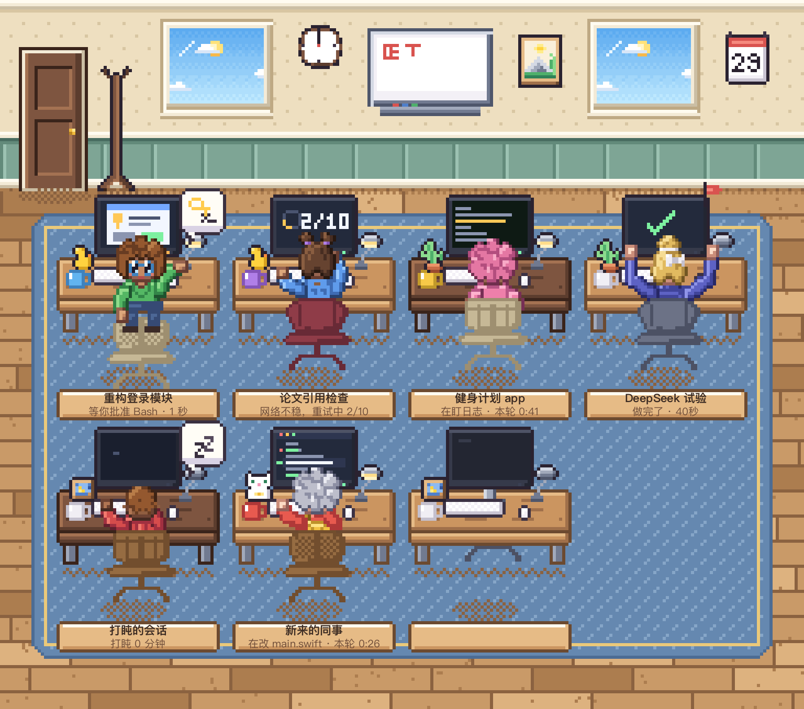
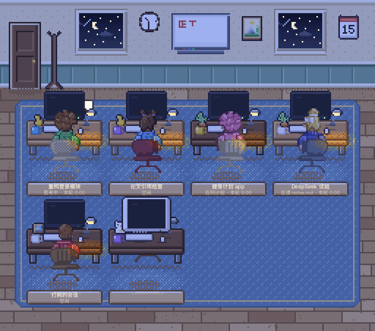
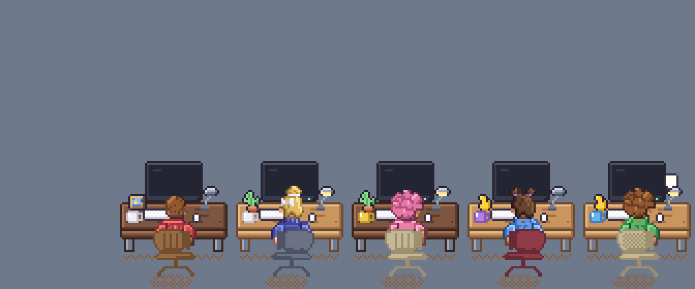
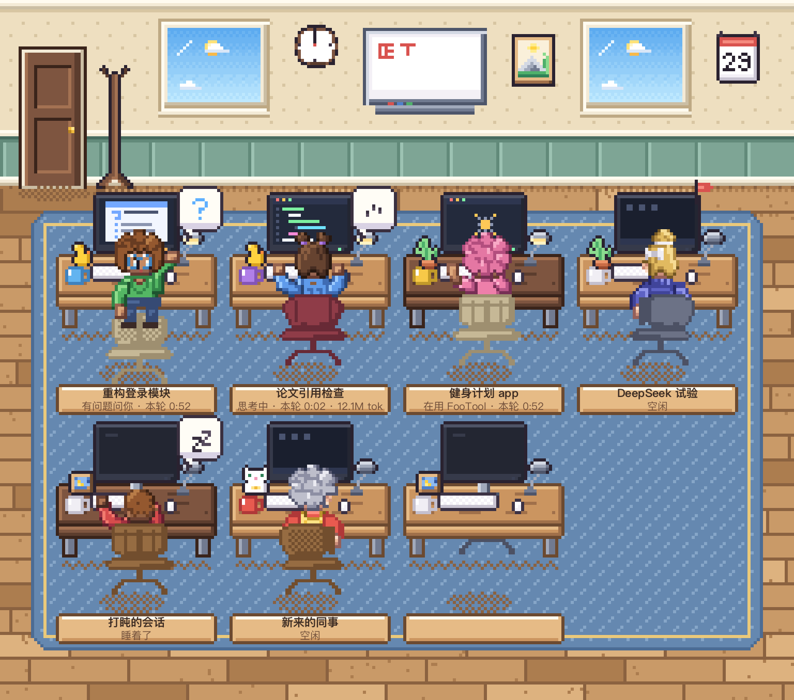
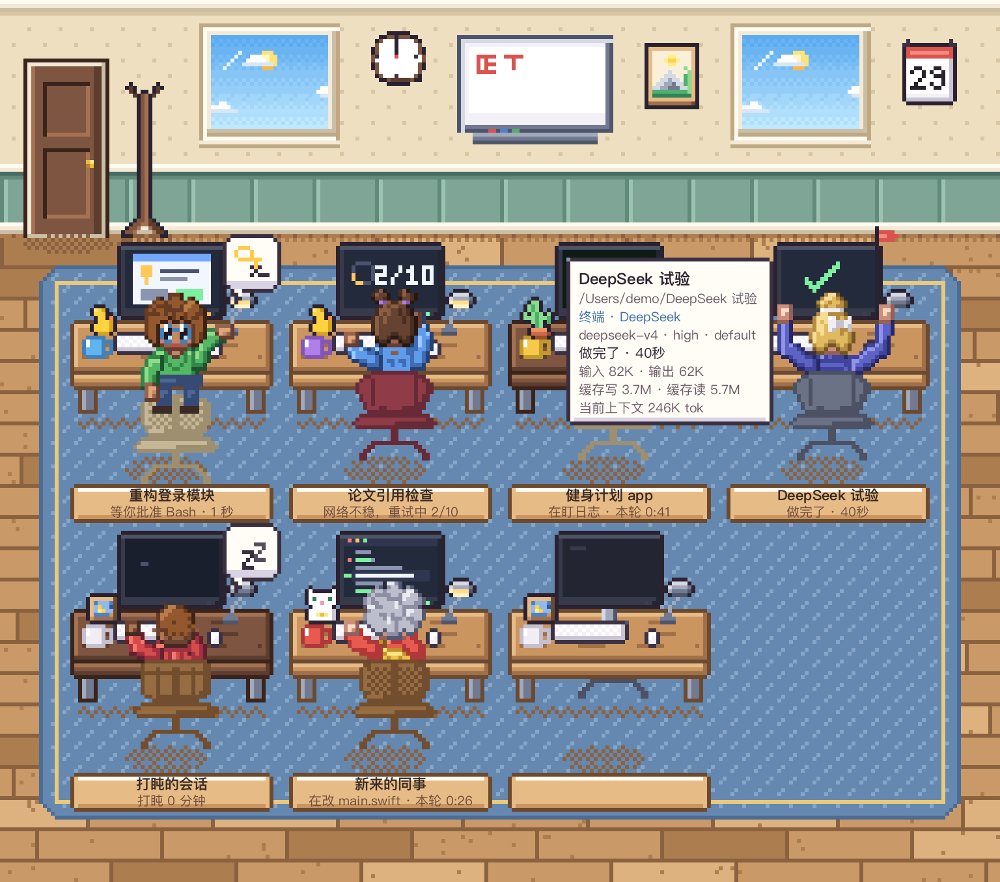

# Buddy 办公室

一间像素风的小办公室，给 [Claude Code](https://claude.com/claude-code) 用的 macOS 小工具。

[](https://github.com/6400550-svg/buddy-office/actions/workflows/ci.yml)
[](LICENSE)


你每开一个 Claude Code 会话（桌面 App、终端、VS Code 都算，通过代理用的 DeepSeek / GLM 会话也算），办公室里就多一个小人坐到工位上。你从他背后看过去，显示器正对着你：谁在忙、在干什么、谁在等你，扫一眼就知道。需要你的时候（等你批准、问你问题、计划等你看），他会转过身来举起手。



- **一个小人 = 一个会话。** 桌牌上写着会话标题、当前在做什么、这一轮用了多久。
- **点小人跳到那个会话；** 鼠标停在他身上会出一张卡片（目录、模型、状态、token 明细）。
- **有人等你 / 一轮做完了：** 弹提醒，Dock 图标有数字角标，菜单栏图标变成举手的小人。
- **也能看见 Codex（GPT）在干活：** 你的 Codex 里正在跑的线程同样会有一个小人坐下（[Codex](https://openai.com/codex) 桌面 App / CLI，读的是本机 `~/.codex` 的会话记录）。
- **只在本机读取，不联网，没有任何遥测。**



## 安装

### 方式一：下载 Release（推荐，不用编译）

1. 到 [Releases](https://github.com/6400550-svg/buddy-office/releases/latest) 下载 `BuddyOffice-*-macos-arm64.zip`，双击解压。
2. 打开「终端」，运行下面三行（把路径换成你解压出来的文件夹，也可以输入 `cd ` 后把文件夹拖进终端）：

```bash
cd ~/Downloads/BuddyOffice-1.1.0
xattr -dr com.apple.quarantine .
bash 安装.command
```

要求：**Apple 芯片（M1 及以后）的 Mac，macOS 14 或更高**，不需要装任何开发工具。

> **为什么要那行 `xattr`？** App 没有付费的 Apple 开发者证书签名（也没有公证），浏览器下载的文件会被系统打上“隔离”标记，直接双击会被拦下。这一行只是去掉这个标记，只处理你刚解压的这个文件夹。你也可以先看一眼 [`安装.command`](%E5%AE%89%E8%A3%85.command) 和源码再决定。

### 方式二：从源码安装

适合 Intel Mac，或者想自己改代码的人。需要 macOS 14+ 和命令行开发者工具（没有的话，安装程序会触发苹果的安装窗口）。

```bash
git clone https://github.com/6400550-svg/buddy-office.git
cd buddy-office
bash 安装.command
```

第一次会现场编译，大约 1～3 分钟。

### 安装过程和之后

- 中途会问一句“要不要让 Buddy 办公室跟着 Claude 自动打开？”，回答 Y（直接回车）就会在 `~/.claude/settings.json` 里加一条“会话启动”hook，改动之前会先备份成 `settings.json.bak-日期-时间`。
- 装好后 App 在 `~/Applications/Buddy 办公室.app`，Dock 和菜单栏各有一个图标。
- 没有会话时办公室是空的，牌子上写着“今天还没人上班”；开一个 Claude Code 会话，几秒内就会有人走进来。

**卸载：** 在同一个文件夹里运行 `bash 卸载.command`。它会退出 App、注销开机启动、删除 App，并且只从 `settings.json` 里去掉它自己那条 hook（别的 hook 不动，同样先备份）。

## 三种形态

可以同时开，也可以只开一个。

| 形态 | 说明 |
|---|---|
| **办公室窗口** | 完整的办公室，可任意缩放，会话多了自动排成几列几排；位置和大小会记住。关闭窗口只是收起，程序还在。 |
| **小鱼缸** | 置顶的小窗，紧凑版办公室，可拖动，双击背景回到办公室窗口。最多画 8 个人，多的用“+N”牌子提示。 |
| **桌面宠物** | 没有墙和地板，小人直接坐在屏幕底部，透明且不挡鼠标，只有碰到小人才会拦下点击。 |




切换方式：办公室窗口标题栏右边的三个像素小按钮，或菜单栏图标，或「设置 → 形态」。也可以在设置里打开全局快捷键 `⌃⌥⌘B`。

## 小人在做什么

| 动作 | 含义 |
|---|---|
| 敲键盘 / 快速敲键盘 | 改代码、写文件（快速敲是在写整个文件） |
| 身体前倾、手拿鼠标 | 读文件、看网页、搜索、操作浏览器 |
| 手托下巴 | 在思考 |
| 在便签本上写字 | 列计划 |
| 靠着椅背喝水 | 命令跑了很久 |
| 小助手坐着带轮子的凳子滑进来 | 派了子代理（最多显示 3 个） |
| **转过身、举手，气泡里有钥匙** | **等你批准** |
| **转过身、举手，气泡里有问号** | **有问题问你** |
| **转过身、举着写字板** | **计划做好了，等你看** |
| 伸个懒腰 | 一轮做完了 |
| 两手一摊 / 捂脸 | 被你打断了 / 出错了 |
| 打盹 / 趴着睡着 | 空闲超过 10 分钟 / 45 分钟 |
| 桌上插着一面小旗 | 有你还没看的新结果 |
| 门口衣帽架上挂着他的外套 | 这个桌面会话已经收起（下班了） |

窗外的天色、墙上的钟、白板上的“正”字（每 5 笔一个，记着今天做完了几轮）用的都是真实时间。小人的样子由会话身份决定，同一个会话每次都是同一个人；右键 →「换个造型」可以换。



## 点击、提醒、悬停

- **点小人：** 桌面 App 会话用深链直接跳过去；终端会话切到对应的标签页（第一次会请求“自动化”权限）；VS Code 会话把 VS Code 带到最前。
- **悬停 0.25 秒：** 出一张卡片，写着标题、目录、模型、状态、本轮用时、token 明细。
- **右键：** 跳转 / 换个造型 / 隐藏这个 buddy。
- **提醒**（「设置 → 提醒」里逐项开关）：等你批准 / 提问 / 计划待审，连续等了 1.5 秒才提醒；一轮做完，用时超过 30 秒才提醒（可调）；你正在看那个会话时不提醒；同一个小人 20 秒内最多一次；多人同时等你会合并成一条。系统通知没授权时，用屏幕右上角的像素提示面板、Dock 角标和菜单栏举手图标兜底。



**演示模式：** 菜单栏图标 →「演示模式」，6 个假小人按剧本把所有状态演一遍，适合看效果或录屏。

## 隐私

- 只显示本机正在运行的 Claude Code 会话和 Codex 线程，网页版 claude.ai / chatgpt.com 的聊天不在里面。
- Codex：只读 `~/.codex/session_index.jsonl`（线程标题）和 `sessions/` 下的会话记录，只留事件类型、工具名、时间、token 数，不读对话内容，也绝不会打开同目录的 `auth.json`（登录凭据）。Codex 里“等你批准”不会写进记录，所以只有它“问你问题”时小人才会举手。可以在「设置 → 其他 → Codex（GPT）」里关掉。
- **不读你的提问内容（prompt）。** 界面里的文字只有会话标题、文件名、命令的前几个词这类元数据；开「隐私模式」连这些也隐藏。
- 不联网，没有遥测。
- 对系统的唯一改动是 `~/.claude/settings.json` 里的一条 hook，卸载时删除。
- 装了 ccmon 的 hook 时小人的动作更及时（工具一开始/结束就知道）；没装则靠会话记录和进程信息推断，会慢一点，也能用。

## 从源码构建与开发

Swift 6 / SwiftPM，全部代码画图，没有图片资源；App 层是 AppKit。

```bash
scripts/dev.sh build              # 调试构建
scripts/dev.sh test               # 测试（自动补上命令行工具下找不到 Swift Testing 的参数）
BUDDY_SCRATCH=.build scripts/dev.sh build -c release   # 发布版
```

| 目标 | 作用 |
|---|---|
| `BuddyCore` | 数据层：读会话、状态融合（只依赖 Foundation / Darwin / FSEvents） |
| `PixelKit` | 画布、调色板、精灵、弹簧、PNG/GIF 导出 |
| `BuddyArt` | 全部美术（代码形式的像素精灵） |
| `BuddyStage` | 表现层：场景、布局、屏幕内容、闪烁扫描 |
| `BuddyOffice` | App 本体（AppKit 胶水：窗口、提醒、跳转、设置） |
| `buddyctl` | 无头命令行工具：`snapshot` 渲染 PNG、`verify` 局部重绘对比、`golden` 金图哈希、`bench`、`text-audit` 等 |
| `buddydump` | 只依赖 `BuddyCore` 的会话数据转储 |

想看渲染结果不用开 App：`buddyctl snapshot --scene office --mode demo --from 41 --to 41 --zoom 3` 直接出图。改了渲染代码之后请跑 `buddyctl verify`。

更多细节：

- [DESIGN.md](DESIGN.md)：环境实测、每个里程碑的验收、设计决定、已知限制
- [PROGRESS.md](PROGRESS.md)：构建 / 运行 / 调试参数速查
- [QA/](QA/)：独立审查记录（问题清单、规格对照、最终回归报告）
- [使用说明.txt](使用说明.txt)：完整的使用说明

## 常见问题

- **装好了但办公室里没有人：** 只显示“正在运行”的 Claude Code 会话；「设置 → 数据源诊断」能看到它现在读到了什么。
- **点小人没有跳到会话：** 看诊断页里“深链”是否被自动停用；终端会话需要在「系统设置 → 隐私与安全性 → 自动化」里授权。
- **不想自动打开：** 双击「卸载.command」，或运行 `python3 scripts/hook-merge.py uninstall`。
- **想完全退出：** 菜单栏图标 → 退出。关闭办公室窗口只是收起。

## 许可证

[MIT](LICENSE)。像素美术全部由代码绘制，声音在运行时合成，仓库里没有第三方素材；中文文字用系统自带的苹方渲染，不随仓库分发。
